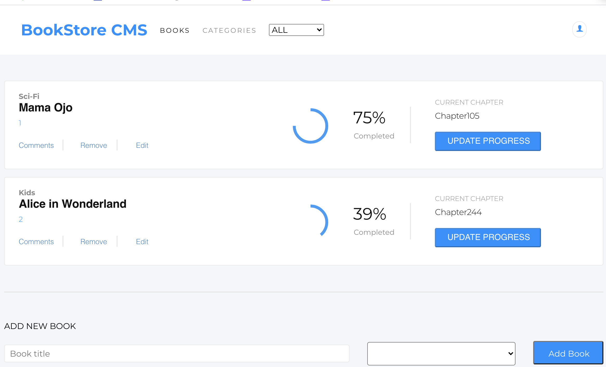

# BookStore App

## About

The project implements a simple book store application with the following functionality:

- Display all books in the store with progress
- Filter books by category
- Add a new book
- Remove a book from the store

## Preview

## Built With

- React
- Node.js
- Redux
- Sass
- ES6
- npm

# Setup

[Clone App](https://github.com/nganifaith/react-Bookstore).

- cd to react-Bookstore
- run `npm install`
- run `git checkout milestone3`
- run `npm start` app opens on [http://localhost:3000](http://localhost:3000)

### Prerequisites

Basic knowledge about React and Redux:

## Live site

[Live](https://deploy-preview-1--cocky-curie-63100a.netlify.app/)

## Author

👤 **Ngani Faith**

- GitHub: [@nganifaith](https://github.com/nganifaith)
- Twitter: [@Bright_Ngani](https://twitter.com/bright_ngani)
- LinkedIn: [Ngani Faith](https://www.linkedin.com/in/ngani-faith/)

## 🤝 Contributing

Contributions, issues, and feature requests are welcome!

Feel free to check the [issues page](https://github.com/nganifaith/react-Bookstore/issues).

## Show your support

Give a ⭐️ if you like this project!

## 📝 License
